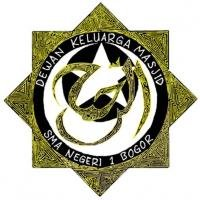

## Apa yang akan Kamu Ceritakan pada Mereka?

18 Oktober 2009

Ini cuplikan dari mabit kemarin malem, dan bagi siapa saja yang ikut mabit saya yakin kalian juga merasakannya. ini hanya tulisan biasa. Diambil dari jurnal harian yang saya tulis tadi malem. Tapi semoga memberikan kita pemahaman apa artinya bersungguh-sungguh. Karya dan prestasi adalah dokumentasi bahwa kita pernah ada. Dan bayangkan, bila pods DKM Ar-Rahmah tahun 2017 nanti.. apa yang ingin kita katakana pada capendekar saat itu? Apakah kita bisa menceritakan rangkaian prestasi membanggakan kepada mereka.. atau bahkan, kita nggak berani menceritakan apa-apa pada mereka.. karena tidak ada yang patut untuk dibanggakan?

suatu saat, kita perkenalkan lambang ini pada dunia

*Sabtu, 18 oktober 2009* 

Di mabit tadi, ada satu acara yang tidak terlalu lama tapi cukup membuat saya terkesan. Kalau tidak salah temanya adalah tanggung jawab pengurus DKM Ar-Rahmah. Pertama saya mendengar tema ini, yang saya bayangkan adalah sebuah ceramah suntuk yang dibawa oleh seorang yang sudah “sepuh”, dibawakan dengan bahasa yang formal, dan biasanya berpotensi membuat peserta ngantuk dan bosan. Tapi sayang, gambaran ini benar-benar berbeda dari yang saya duga. Dan saya bersyukur dengan ini.

Nama pembicaranya A Jati, saya lupa nama panjangnya. Tapi yang pasti beliau adalah ketua umum DKM Ar-Rahmah tahun kepengurusan 1999-2000. Dalam diskusi ini, a Jati tidak membuat berbagai penjelasan rumit dan membuat suntuk tentang apa itu tanggung jawab, AD-ART DKM, atau memberikan kuliah teknis yang terlalu membosankan.

Dari parasnya, ia terlihat masih sangat muda. Sekitar umur 24 atau 26 tahun. Kulitnya putih, berjanggut, dan berkacamata. Lulusan trisakti teknik elektro, dan sekarang tinggal di ciomas bogor. Dan saya memang sudah menduga, ia adalah orang yang cerdas.

Dalam waktu sekitar satu jam, a Jati nyaris tidak memberikan materi kontekstual sama sekali, beliau justru memberika contoh realnya. A Jati menyuguhkan kita kisah-kisah yang memuat semangat setiap yang mendengarnya berkobar. Banyak dari kami banyak yang bergumam ,”wow..” atau “wuuh..” saat mendengar berbagai prestasi yang dicapai oleh DKM angkatan beliau baik dari prestasi organisasi maupun prestasi-prestasi individu dkm ar-rahmah. Banyak sekali pengurus dkm ar-rahmah yang merupakan “star performers”-nya smansa. Mereka orang-orang yang cerdas, banyak yang mendapat kesempatan kuliah di luar negeri, masuk jurusan-jurusan yang bergengsi saat kuliah, dan banyak dari mereka yang menjadi juara umum, dan juga master-nya olimpiade. Termasuk ka Budi yang katanya belum ada yang bisa mengalahkan beliau dalam bidang prestasi akademis (termasuk olimpiade internasional) di sman 1 bogor, dan dia juga anak DKM.

Angkatan a Jati-lah yang mempelopori adanya sanlat disekolah-sekolah di bogor, yang saat itu pertama kali diadakan oleh sma n 1 bogor oleh DKM Ar-Rahmah. Angkatan a Jati jugalah yang pertama kali membuat majalah BIRU, mengadakan acara salam, dan selalu mendapat banyak keuntungan melimpah setiap ada bisnis yang diadakan DKM. A Jati menggambarkan dengan jelas betapa DKM Ar-Rahmah adalah ekstrakurikuler paling berkelas di smansa. Semua petinggi-petinggi organisasi saat itu adalah pengurus DKM Ar-Rahmah. Dan ternyata, periode kepengurusan a jati itu adalah angkatan dengan jumlah anggota terbanyak, yaitu lebih dari 300 anggota. Subhanallah.

Tadinya saya berfikir, sulit sekali menemukan orang yang bisa dijadikan “benar-benar teladan”. Artinya, dia bisa jadi teladan bagi aktivis-aktivis organisasi, tapi juga bisa jadi teladan dalam prestasi dan ilmu pengetahuan. orang-orang seperti ini bisa dihitung dengan jari. Ini membuat saya termenung. Dan saya yakin kuncinya adalah dengan manajemen yang professional, pengurus yang mempunyai loyalitas, dan ukhuwah yang berkesinambungan. Sehingga dengan begitu terciptalah sebuah komunitas atau jaringan yang saling membangun satu-sama lain. Dan setiap jaringan ini mempunyai koneksi yang sangat berharga. Artinya setiap individu DKM adalah orang-orang militan, orang-orang yang cerdas, dan orang-orang yang menginspirasi. Sehingga secara otomatis mereka mampu membangun “tribe” sendiri, mampu memberi pengaruh besar bagi lingkungam, dan itulah buah dari sebuah komitmen yang kuat. Sebuah pencapaian visi yang indah dan menantang. Tidak ada kata lain untuk menggambarkan situasi ini selain satu kata : KEBERHASILAN.

insyaAllah, saya dan teman-teman dkm ar-rahmah 2009-2010 bisa mencapai dua kali.. atau tiga kali lebih membaggakan dari angkatan terdahulu, dari angkatan a Jati. Saat ini tantangan semakin berat. Dan inilah kesempatan kami untuk membuat perubahan. Mengukir jejak prestasi, dan membuat pencapaian-pencapaian bermutu. Karena kami adalah pelajar-pelajar muslim yang cerdas, berani, dan berfikir besar. insyaAllah.

*Kami tahu,*
*Begitu panjang dan melintang jalan yang akan kami tempuh*
*Dan kami sudah memulai satu langkah itu.*

AllahuAkbar!

PS : ada yang mau di tag? siapa aja ini mah.. mumpung blom limit nih.