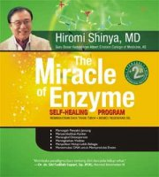
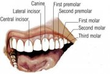

## Konsepsi Gaya Hidup Sehat dan Implementasinya

29 September 2009

Artikel ini saya buat sebagai studi analisis sederhana tentang kesehatan, ini berkaitan dengan keluarnya buku yang saat ini sudah menjadi best seller yaitu ‘The Miracle of Enzyme” karya Dr Himori Shinya. Tapi bukan hanya menyandang predikat “best seller”, buku ini juga membuat banyak orang terkejut (agak lebai sih, hhe). Untuk membuatnya menjadi lebih mudah, saya sarankan kamu untuk membaca resumenya yang ditulis adek (kelas) saya, Atika Almira di [Note Ini](http://www.facebook.com/note.php?note_id=140663696694&id=1656966085&ref=mf) atau di [Blognya](http://tikathinksthings.blogspot.com/). 

Kajian ini saya tekankan mengenai konsepsei kesehatan yang dikaitkan dengan sunnah Rasulullah, yang selain sebagai pemimpin yang berpengaruh juga sebagai orang yang gaya kehidupannya patut diteladani. Disini, saya mengutip beberapa hadits dan ayat Al-Qur’an agar bisa membuat kita lebih memahami betapa Allah dan Rasulnya juga sangat menekankan manusia menjaga kesehatannya, karena kesehatan adalah amanat yang harus dijaga dan dipergunakan dengan baik. 

Bukunya.. cari aja di gramedia terdekat :P

Tulisan ini membahas ilmu kedokteran, yang tentu bagian dari ilmu pengetahuan. Dan sudah takdirnya ilmu pengetahuan selalu berevolusi selama rasa keingin tahuan manusia masih ada. Seperti menurut Kazuo Murakami, pertanyaan yang sering diulang-ulang para ilmuwan adalah, “Ada yang baru?”. Oleh karena itu, kadang teori-teori ilmiah bersifat validitas dan akan terganti dengan teori-teori yang baru. 

Akhir kata, bila ada kebenaran-kebenaran yang terkandung dalam tulisan ini, itu datangnya dari Allah, dan bila ada kesalahan-kesalahan, itu bukan kesalahan Rasulullah tapi semata-mata datangnya dari kebodohan saya. Semoga artikel ini bisa bermanfaat.

--------------------------------------------------------------------

### Konsepsi Gaya Hidup Sehat dan Implementasinya

*Oleh : M. Nasrurrohman* 

**Maka hendaklah manusia itu memerhatikan apa yang dimakannya..**
**(QS 'Abasa [80]:24)**

Melihat kondisi dan gaya hidup yang selama ini saya lihat dikehidupan sehari-hari, rasanya semakin benar apa yang dikatakan Rasulullah, “*Dua nikmat yang sering dilalaikan manusia yaitu kesehatan dan waktu luang*.” Betapa banyak anak-anak muda yang mempunyai lima indra dengan lengkap, punya tangan, punya kaki tetapi mereka memilih untuk duduk dijalanan dan meminta belas kasihan orang. Betapa banyak orang yang meyia-nyaiakan waktunya dengan hal-hal yang tidak bermanfaat, bahkan mengisinya dengan berbagai bentuk kemaksiatan, kejahatan, dan pelanggaran-pelanggaran sosial. 

Media informasi semakin membuat banyak kebohongan. Makanan produksi Amerika Serikat seperti *burger, fried chicken* dan *hot* dog yang di Negara produsennya sendiri dianggap makanan sampah (*junk food*) di Negara kita malah dijadikan trend. Bahan-bahan kimia sintesis yang jauh dari sifat alami justru dijadikan makanan favorit.

Kita hidup dilahan yang kaya dan subur, tanaman-tanaman dapat tumbuh dengan sehat, buah dan sayurnya merupakan kualitas terbaik. Tetapi entah kenapa jumlah orang sakit justru semakin banyak. Penyakit-penyakit aneh bermunculan seolah semakin berkembangnya teknologi medis, semakin berkembang pula bibit-bibit penyakit baru. Bahkan, produk alami seperti sayur dan buah-buahan sudah tercemar pestisida. Budaya western dengan mode 3F life style (*food, fun, fashion*) telah dijadikan kiblat kebanyakan orang.

Kita semua tentu ingin hidup dengan bermanfaat dan menjalaninya dengan penuh kesejahteraan. Dan salah satu syarat terpentingnya adalah kita harus sehat. Herophilus, dokter yang hidup di era 323 SM mengatakan, “*Ketika tidak ada kesehatan, kearifan dengan sendirinya tidak tercapai, seni tidak akan muncul, kekuatan akan sirna, kekayaan menjadi tidak berguna, dan kecerdasan tidak akan bisa di praktikkan.* ”

Lihatlah di ruang-ruang Intensive Care Unit (ICU) di rumah sakit. Ada banyak orang terkapar lemas yang sekujur tubuhnya disambungi selang. Infus di pembuluh darahnya, makanan dan gizi diberikan lewat selang lambung dan selang-selang lain. Kesehatan yang layaknya dapat kita nikmati dengan gratis, berubah harganya menjadi sangat mahal, puluhan bahkan mengabiskan ratusan juta hanya untuk bertahan hidup. Berkunjunglah ke rumah sakit dan tempat-tempat memprihatinkan, jangan hanya sering ke mall atau taman bermain.. insyaAllah, kita bisa lebih merasakan betapa berharganya kesahatan, dan bersyukurlah karena kita masih diberi kesempatan untuk hidup dengan jiwa raga yang sehat.

asanya, pendapat DR Shinya dalam buku “The Miracle of Enzyme” mirip dengan apa yang dikatakan oleh nabi Muhammad SAW. “Perut adalah pangkal berbagai penyakit.” Dr Shinya menyatakan bahwa, sehat atau tidak bergantung pada apa yang dimakan dan cara hidup seseorang. Pencernaan yang bersih akan mudah melawan berbagai penyakit. Dan ini semua tidak berlangsung secara tiba-tiba, semua penyakit yang ada adalah akumulasi dari gaya hidup sehari-hari selama bertahun-tahun. Kesehatan jangka panjang adalah hasil dari tingkah laku dan kebiasaan-kebiasaan yang sehat.

Tapi, bukankah factor genetis juga berpengaruh? Ya, benar. Gen dari orang tua kita memang berpengaruh. Seoarng anak yang sehat, bisa juga karena orang tuanya yang juga sehat. Tapi bukan gen sebagai faktor terbesar, kebiasan-kebiasaan yang diwarisi orang tua itulah yang membuat si anak menjadi pribadi sehat mirip dengan orang tuanya.

Penelitian DR John Rowe, MD. President of Mount Sinai Hospital yang memimpin The MacArthur Foundation Research Network on Successful Aging di New York membuktikan bahwa faktor genetik hanya mempengaruhi 1/3 dari status kesehatan fisik manusia, sedangkan 2/3 lainnya lebih dipengaruhi *lifestyle*, pekerjaan, makanan, bagaimana kita me-manage stress, hubungan-hubungan sosial dan sense kekuatan personal.

Ini semakin diperkuat dengan hasil penelitian seorang ahli genetika, Kazuo Murakami bahwa DNA yang merupakan tinta biru kehidupan ternyata memiliki plastisitas dan memungkinkan untuk diubah dan dibentuk. Bahkan bukan hanya dari segi biologis saja, tapi juga dari segi mentalitas, kebiasaan, dan psikologis seseorang bisa dirubah. Dengan merubah gennya. Caranya adalah dengan menjalani hari-hari semaksimal mungkin dengan sikap positif. 

**Gaya Hidup Sehat**

Dalam bukunya, Dr Shinya menawarkan resep-resep ampuh agar bebas dari penyakit. Ini terbukti dari dirinya sendiri yang selama 50 tahun terakhir, tidak pernah mendapatkan perawatan medis dan tetap sehat, begitu juga dengan ribuan pasien-pasiennya, mereka yang telah melaksanakan diet gaya hidup sehat enzyme ini tidak ada satupun pasien kankernya kambuh. Saran-saran itu adalah :

1. Menu makanan yang baik
2. Pembuangan yang teratur
3. Olah raga secukupnya
4. Istirahat yang cukup
5. Pernapasan dan meditasi, serta
6. Menikmati kebahagiaan dan cinta

Satu hal yang cukup membuat saya sangat kaget adalah, DR Shinya sangat tidak menyarankan untuk meminum susu olahan yang biasa dijual. Beliau memberi banyak fakta-fakta penelitian, yang mengindikasikan betapa buruknya susu yang selama ini kita minum. Media-media telah meracuni doktrin bahwa untuk menjaga tulang kuat harus minum susu, padahal susu lah yang justru membuat seseorang terkena osteoporosis.

Menurutnya, susu itu benda cair sehingga ketika diminum dan masuk ke mulut ia akan langsung mengalir ke kerongkongan. Karena cepatnya mengalir ke kerongkongan, susu tidak sempat lagi berinteraksi dengan enzim yang diproduksi oleh mulut kita. Akibat tidak bercampur dengan enzim, maka tugas usus akan semakin berat. Dan begitu sampai di usus, susu tersebut langsung menggumpal dan sulit sekali dicerna. Karena sulit dicerna, tubuh kita terpaksa mengeluarkan cadangan “enzim induk” yang seharusnya kita hemat.

Yang membuat sebagian kita bingung adalah, nabi sendiri menyarankan kita untuk minum susu dari hewan-hewan ternak. Tapi, saya garis bawahi bahwa susu yang dimaksud oleh DR Shinya adalah susu olahan manusia, bukan susu murni. Apalagi Rasulullah justru meneladani kita meminum susu kambing segar, yang langsung diminum sesudah diperah (kisah Abdullah bin Mas’ud pada masa remaja saat dia menggembalakan kambing milik Uqbah bin Mu’aith).

Persoalan apakah susu sapi itu berbahaya, saya sendiri percaya dengan DR Shinya karena ia sudah menelitinya dan tidak asal bicara, ia juga telah membuktikannya. Minumlah air putih, pertimbangkan untuk tidak meminum susu olahan manusia. 

Untuk berjaga-jaga dan menghindari keraguan, bagi temen-temen yang sudah komitmen untuk benar-benar ingin sehat.. lebih baik jangan mengkonsumsi susu olahan yang banyak beredar. Lebih baik, susu kambing atau susu kacang kedelai.

**Komposisi makanan yang ideal**

Ada keserasian sekali lagi mengenai apa saja komposisi makanan yang ideal kita konsumsi dengan saran diet sehat Dr Shinya. Pak Shinya menyarankan kita agar 80-90% makanan yang kita konsumsi berupa makanan nabati. Dan Al-Qur’an pun menyebutkan bahwa sejumlah buah-buahan adalah makanan surga. Nabi Muhammad sendiri sangat menyukai buah labu.

Dr Ade Hasman, dalam bukunya “Rasulullah Tidak Pernah Sakit” menjelaskan bahwa tumbuh-tumbuhan memiliki factor proteksi botanic (*Protective Botanical Factors*) secara alamiah, tidak seperti dunia fauna yang bebas aktif bergerak menghindari bahaya, dunia tumbuhan tidak dapat berpindah aktif menghindari bahaya sehingga secara intrinsic tumbuh-tumbuhan dikaruniai kemampuan detoksifikasi terhadap peracunan disekitarnya. Kandungan nutrisi dalam factor-faktor botanik diantaranya antioksidan, antikarsinogenik, imunomodulator, dan bioflavonoid yang bermanfaat untuk kesehatan semua itu terdapat pada padi-padian, tumbuhan polong, tumbuhan biji, kedelai, buah jeruk dan sayuran hijau.

Tapi ingat, itu bukan berarti kita tidak boleh makan daging. Nabi Muhammad SAW pernah bersabda, “Aku pun memakan daging”. Apalagi ikan segar yang biasa dikonsumsi oleh masyarakat Jepang adalah contoh yang cuku baik. Sebab seluruh makhluk laut halal hukumnya dikonsumsi oleh kita. Tapi ingat juga pesan sayidina Umar bin Khattab, “Jangan kau jadikan perutmu sebagai kuburan hewan-hewan ternak. ”

Komposisi terbaik makanan adalah 85-95% makanan nabati, sementara 10-15% protein hewani.

Kita bisa lihat keseragamannya dengan struktur gigi kita sendiri. Manusia mempunyai 32 gigi lengkap dengan 4 gigi taring untuk memotong-motong daging dan 20 gigi geraham untuk mengunyah makanan dari biji-bijian. Ini mengidentifikasikan bahwa manusia memang selayaknya mengkonsumsi makanan nabati lebih banyak ketimbang daging.

Apalagi bila kita lihat, hewan-hewan herbivora mempunyai kekuatan otot dan ketahanan tubuh yang kuat di banding karnivoranya. Lihatlah kuda, sapi, dan unta. Meskipun tidak makan banyak hewan-hewan ini bisa bertahan dengan kuat. Berbeda dengan singa yang walaupun memang kuat, tapi ketahanan berlari kencang tidak konstan, dan cenderung semakin melambat. Semantara kuda dapat berlari lebih cepat dan lebih lama. Otot-otot hewan-hewan herbivora inipun ternyata lebih kuat. Lihat saja, badak yang begitu gagahnya saja tidak makan danging kan? Berani lawan badak? Hhe..

Oh ya, satu lagi saran yang harus dicermati. DR Shinya menyarankan kita untuk mengunyah setiap suap sebanyak 30-50 kali. Kamu tahu Rasulullah sendiri mengunyah berapakali setiap satu suapan? 40 kali! 

**Bersikap Positif**

Adalah Himawan Tedjo Mulyono, yang meraih empat rekor MURI justru ketika usianya diatas 65 tahun. Di usianya yang menginjak 71 tahun ia berhasil memecahkan rekornya sendiri dengan menaklukan puncak gunung Rinjani yang berketinggian 3726 meter! Keteika ditanya apa resepnya, orang tua yang masih gagah ini menjawab, “Saya berusaha berserah diri, bertobat pada Tuhan, menyukuri apa yang ada, dan menikmatinya. ”

Yang menarik, dalam buku “The Miracle of Enzyme” ini dr. Shinya menyarankan kita untuk memakan makanan yang enak. Dengan makan enak, hatinya senang. Kalau hatinya sudah senang dan pikirannya gembira, terjadilah mekanisme dalam tubuh yang bisa membuat enzim-induk bertambah.

Rasulullah sendiri mengajarkan kita bahwa kesehatan itu juga sangat berhubungan dengan akhlak. Akhlak yang baik cenderung melahirkan jiwa yang sehat, sementara akhlak yang buruk akan memicu timbulnya penyakit.

Lihatlah Umar bin Khattab atau Ali bin Abi talib. Mereka tidak meninggal karena penyakit, mereka syahid karena dibunuh. Sahabat-sahabat rasul terdahulu bukan hanya mewariskan keteladanan dalam berakhlak dan menjalani hidup sebagai seorang muslim, tapi juga memberikan keteladanan menjalani gaya hidup sehat. Mari kita bersama-sama untuk mengikuti jejak mereka. 

Caranya adalah dengan “Ibda’ binnafsik!”, mulailah dari dirimu, begitu kata Rasulullah SAW.

Adalah Himawan Tedjo Mulyono, yang meraih empat rekor MURI justru ketika usianya diatas 65 tahun. Di usianya yang menginjak 71 tahun ia berhasil memecahkan rekornya sendiri dengan menaklukan puncak gunung Rinjani yang berketinggian 3726 meter! Keteika ditanya apa resepnya, orang tua yang masih gagah ini menjawab, “*Saya berusaha berserah diri, bertobat pada Tuhan, menyukuri apa yang ada, dan menikmatinya.* ”

Yang menarik, dalam buku “The Miracle of Enzyme” ini dr. Shinya menyarankan kita untuk memakan makanan yang enak. Dengan makan enak, hatinya senang. Kalau hatinya sudah senang dan pikirannya gembira, terjadilah mekanisme dalam tubuh yang bisa membuat enzim-induk bertambah.

Rasulullah sendiri mengajarkan kita bahwa kesehatan itu juga sangat berhubungan dengan akhlak. Akhlak yang baik cenderung melahirkan jiwa yang sehat, sementara akhlak yang buruk akan memicu timbulnya penyakit.

Lihatlah Umar bin Khattab atau Ali bin Abi talib. Mereka tidak meninggal karena penyakit, mereka syahid karena dibunuh. Sahabat-sahabat rasul terdahulu bukan hanya mewariskan keteladanan dalam berakhlak dan menjalani hidup sebagai seorang muslim, tapi juga memberikan keteladanan menjalani gaya hidup sehat. Mari kita bersama-sama untuk mengikuti jejak mereka. 

Caranya adalah dengan “Ibda’ binnafsik!”, mulailah dari dirimu, begitu kata Rasulullah SAW.

Dalam tulisan ini, saya mencoba berbagi informasi berupa poin-poin penting yang harus kita jadikan gaya hidup agar kita bisa hidup sehat tanpa sakit. Dan dengannya kita bisa mengisi hari hari dengan produktifitas yang bermanfaat. Dan disini, saya bukan Dokter (mungkin belum?), saya juga masih belajar untuk merubah kebiasaan-kebiasaan buruk yang merusak kesehatan, jadi mari kita belajar bersama. Karena salah satu kriteria orang yang beruntung versi al-Quran adalah orang yang senantiasa saling mengingatkan dalam kebaikan dan kesabaran.

Kalau memang ada pertentangan antara data ilmiah dengan keterangan agama, yang patut dipertanyakan adalah penyataan ilmiahnya, atau”pemahaman” tentang agama tersebut (bukan teks normatifnya). Karena kebenaran hanyalah milik Allah. Dengan Ilmu Pengetahuan, kita berusaha mencari kebenaran. Dan seperti yang pernah terjadi dalam sejarah, ilmu pengetahuan, teori-teori ilmiah bisa saja berstatus validitas, artinya, bisa saja ia diruntuhkan oleh teori-teori yang dimasa depan nanti akan muncul. Persis seperti dahulu selama lusinan abad manusia percaya bahwa bumi itu datar. Atau dulu orang beranggapan bahwa atom adalah partikel terkecil dalam kehidpan, padahal ada partikel-pertikel penyusun Atom yang jauh lebih kecil, bahkan saat ini telah ditemukan susunan yang jauh lebih kecil dari neutron, proton, dan elektron itu sendiri.

Jika dalam artikel ini ada benarnya, Allah lah yang benar, jika dalam artikel ini ada salahnya, saya lah yang salah.

Wallahualam.

> [Link ke notes ini di facebook](https://www.facebook.com/notes/muhammad-nasrurrohman/konsepsi-gaya-hidup-sehat-dan-implementasinya/137081313156)