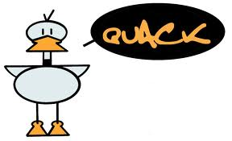

## Do You Play Misery Poker or Quack?

September 2011

Sejak gue SMP sampai sekarang, gue setidaknya tahu dua tipe orang di lingkungan sekolah yang cukup unik. Maksud gue, dua jenis orang ini unik dengan tetap mempunyai keunggulan masing-masing. 

Asumsikan kedua orang ini adalah si A dan si B. Kedua sama-sama punya kemampuan akademis yang bagus banget dan memang pintar, mereka terlihat keren di depan teman-temannya. Tapi, ada perbedaan khusus dari mereka berdua.

Si A, adalah orang yang terlihat biasa aja di luar atau malah terlihat terlalu banyak main. Besoknya ada ujian, si A masih sempet-sempetnya ngomongin strategi namatin game terbaru atau nyari film buat didownload. Saat di kelas, si A ini kadang keliatan nggak serius, cenderung main-main, nggak bikin catetan atau malah suka tidur saat guru/dosen lagi ngajar. Tapi sekalinya si A ngomong, omongannya berkualitas dan menggambarkan kalau dia udah paham isi bab yang bahkan baru akan dibahas. 

Saat melihat hasil ujian, orang-orang kaget karena si A mendapat nilai tertinggi, jauh diatas orang yang terlihat rajin di kelas. Orang akan menganggap dia memang punya kelebihan. Itu membuat teman-temannya kagum.

Kedua, si B. Berbeda dengan A, anak tipe B ini terlihat selalu lihat jam tangan dan punya buku catatan yang selalu dia bawa. Ini mengartikan satu hal: dia sangat disiplin. Dia akan mengeliminasi kegiatan-kegiatan yang nggak perlu. Tapi ada satu hal yang lucu, kalau dia mendengar ada orang yang menyelesaikan tugasnya dengan baik dari jam 12 malem sampai subuh, si B akan bilang, "*Gue ngerjainnya dari jam 2 pagi dan selesai sebelum azan subuh..*" yang menjadi perhatian adalah bukan hanya si B menyelesaikannya dengan lebih cepat, tapi juga mendapat nilai lebih tinggi.

Tipe A kita namakan saja "*bebek*", dia terlihat tenang di atas tapi sebenarnya kakinya bergerak amat gesit di bawah air. Beberapa orang akan membandingkannya dengan anak-anak tipe A dan seakan bilang, "*He never work! He always play pokemon and still do better than me on everything*!"

Sementara Tipe B kita namakan saja "*misery poker*". Tipe B akan membuat teman-temannya berpikir kalau mereka kurang bekerja keras dibanding B, sangat jauh dibanding B, dan merasa tertinggal jauh. 

Tipe A dan tipe B ini gue yakin punya persamaan lain: mereka memang pandai mengatur waktu dan memang disiplin. Orang melihat kedua orang ini jenius atau pintar dari "sono"-nya karena sebenernya.. mereka belum tahu sebenernya gimana cara mereka belajar atau ngatur waktu. 

Karena gue yakin hasil baik yang mereka dapatkan bukan karena mereka terlalu beruntung dengan sangat sering atau terlalu cerdas dibanding yang lain, tapi karena memang sesuatu yang logis. Semua orang bekerja keras. kita kadang nggak tau aja kalau mereka sedang melakukan itu.